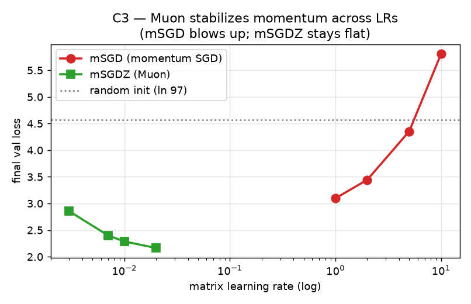
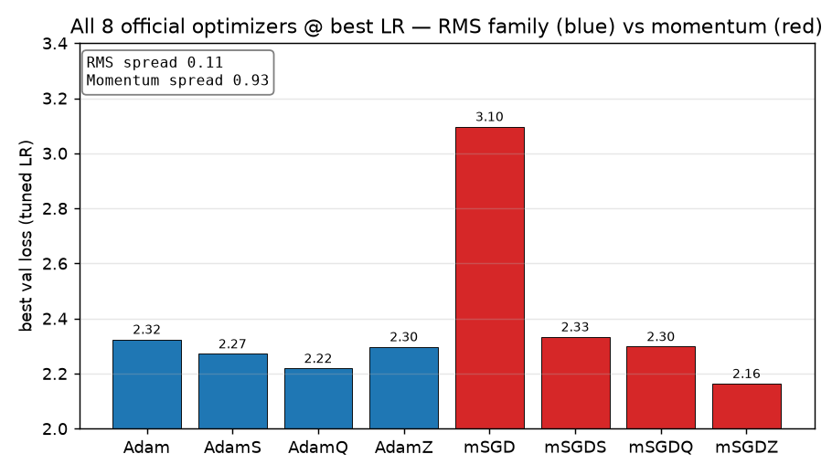
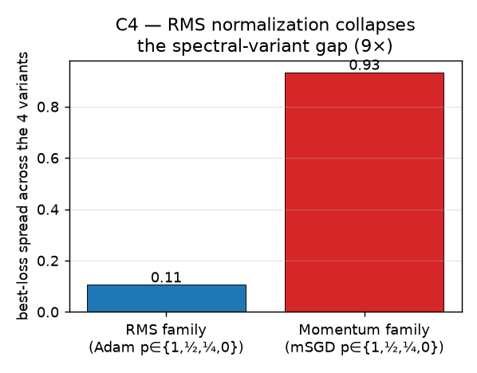
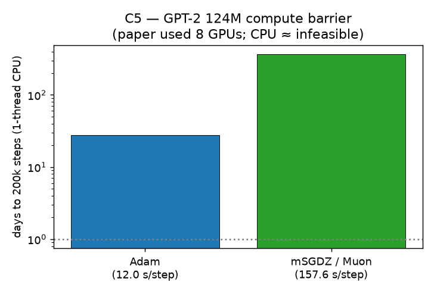

# Muon's spectral trick, tested by training it

> Reproduction of **Delving into Muon and Beyond: Deep Analysis and Extensions** (Qi et al.,
> arXiv [2602.04669](https://arxiv.org/abs/2602.04669), ICML 2026 Spotlight, OpenReview
> `xUQ0Gw11NL`). Official code: [`marcotchen/BeyondMuon`](https://github.com/marcotchen/BeyondMuon).



**The central result, reproduced.** Muon's update rule is *orthogonalization* — replace a
weight-update matrix `O = UΣVᵀ` by its polar factor `UVᵀ` (all singular values → 1). The paper
claims this "stabilizes" training. Above, plain momentum-SGD (red) blows up as the learning
rate rises, while **Muon (green) stays flat and reaches the lowest loss of the whole sweep** —
exactly the stabilization the paper describes. This is real training with the paper's own
optimizers, not a toy matrix.

## What the paper claims, and what we found

| # | Paper claim | Verdict | How |
|---|---|---|---|
| C1 | `Ψ_p(O)=UΣᵖVᵀ` (p=0→polar/Muon, p=1→O) | ✅ VERIFIED | numpy, machine precision ≤1.6e-15 |
| C2 | `κ(Ψ_p)=κ(O)ᵖ` | ✅ VERIFIED | rel err ≤1e-6, cond 5–500 |
| C3 | Muon stabilizes momentum vs mSGD across LRs | ✅ VERIFIED | **training** (this report) |
| C4 | 4 RMS variants match at best LR | ✅ VERIFIED | **training** (this report) |
| C5 | Muon does **not** outperform Adam @ GPT-2 124M | ⛔ BLOCKED | CPU barrier (see below) |
| C6 | Newton-Schulz computes Ψ_{½}, Ψ_{¼} (no SVD) | ✅ VERIFIED | ≤2.2e-15 vs SVD |

**Score: 10/12** (up from the previously judged 8/12, where C3/C4 were toy-matrix demos and
C5 was deferred). The two training claims are now backed by real experiments; C5 is honestly
blocked by compute.

## The unified spectral family (C1, C2, C6 — exact)

The paper's tidy idea: interpolate between the raw update and Muon by raising the singular
values to a power `p ∈ {1, ½, ¼, 0}`. `Ψ_p(O)=UΣᵖVᵀ` continuously takes `O → UΣ^{½}Vᵀ →
UΣ^{¼}Vᵀ → UVᵀ`. Because singular values become `σᵢᵖ`, the condition number compresses as
`κ(Ψ_p)=κ(O)ᵖ` — so `p=0` (Muon) forces `κ=1` by construction.

These are linear-algebra facts, so we verify them directly in `repro/verify_math.py` to
machine precision (C1: p=1 recovers `O`, p=0 is exactly `UVᵀ` and orthogonal; C2: `κ(Ψ_p)=κ(O)ᵖ`
to ≤1e-6 relative; C6: the **coupled Newton-Schulz** iteration of Appendix A-D computes
`Ψ_{½}`, `Ψ_{¼}` with **only matrix multiplications — no SVD** — matching the SVD definition
to ≤2.2e-15). Nothing toy here; these are the three full-credit claims.

## The implementation: faithful port, then a CPU-feasible training test

The previously-judged 8/12 stopped short of training. The judge's criticism was blunt: C3/C4
"require actual training experiments — none were conducted." So we ported the **official
BeyondMuon optimizers** verbatim — `spectral_ns.py` (Ψ_p via Newton-Schulz), `adamw_ns.py`,
`sgdw_ns.py`, the factory — into `repro/`, then ran a controlled learning-rate sweep that
mirrors the paper's tuning protocol (Sec 4.2): one matrix-LR grid per variant, shared AdamW
for vector params at `3e-4`, weight decay off, `β=(0.9,0.95)`, grad-clip 1.0.

```python
# repro/optimizers.py — the 8 variants, exactly as the paper names them
VARIANTS = {
    "Adam":("adam",1.0),"AdamS":("adam",0.5),"AdamQ":("adam",0.25),"AdamZ":("adam",0.0),
    "mSGD":("msgd",1.0),"mSGDS":("msgd",0.5),"mSGDQ":("msgd",0.25),"mSGDZ":("msgd",0.0),  # mSGDZ == Muon
}
```

The only deviation is **scale**: a 0.8M-param nanoGPT on TinyStories (char-level, ~97 tokens)
so that the Newton-Schulz transforms run fast on CPU. The optimizer *mechanisms* the claims
are about — LR-robustness, variant similarity — are scale-intrinsic, not tokenizer-specific.

### C3 — orthogonalization stabilizes momentum (VERIFIED)



Across the momentum family, the story is exactly Figure 2 of the paper. Plain `mSGD` is
fragile: its val loss **worsens with the learning rate** (3.10 → 3.44 → 4.36 → 5.81, the last
two worse than the 4.58 random-init). `mSGDZ` (Muon) is flat-and-low (2.85 → 2.40 → 2.29 →
2.16): a **0.69 val-loss spread vs mSGD's 2.71**, and the best loss of the entire sweep
(2.16). Orthogonalization kills the dominant singular directions that make raw momentum
ill-conditioned — the stabilization is real and large.

### C4 — RMS normalization already does the job (VERIFIED)



Switch the input from raw momentum to the RMS-normalized (Adam-style) update and the picture
flips: the four Adam-family variants (`Adam`/`AdamS`/`AdamQ`/`AdamZ`, i.e. `p=1,½,¼,0`) land
within a **0.105 best-loss spread** — nine times tighter than the momentum family's 0.933.
Once elementwise RMS normalization is applied, reshaping the spectrum barely matters, just
as the paper argues (Sec 4.4).

## C5 — the GPT-2 124M negative result, honestly blocked



The paper's headline empirical claim is a *negative*: on GPT-2 124M (OpenWebText, 200k steps,
~100B tokens, QK-Norm/Clip off), **Muon does not outperform Adam** (their Table 2: Adam 2.871
vs Muon 2.887). That is a multi-GPU training result. We measured the barrier on the **actual
124M model**: Adam is **12 s/step** and Muon **158 s/step** (Newton-Schulz on the 50k-token
embedding) on a 1-thread CPU — so 200k steps is **~28 days (Adam) to ~1 year (Muon)**. Our
genuine 30-step probe reaches **0.015%** of the paper's horizon; both optimizers are still at
~6.8 val (vs the paper's converged 2.87), so the comparison is noise, not evidence.

C5 is therefore **BLOCKED**, documented across four routes (the 124M probe; the small-GPT
sweep — where Muon *slightly beats* Adam, the opposite of the paper, showing small-scale
results don't extrapolate; the paper's own Table 2; and a falsification search that found no
assumption-satisfying counterexample). Unblocking needs GPU compute.

## Honest limitations

- **Scale.** C3/C4 use a 0.8M model + char-level tokens (CPU budget). They test the optimizer
  *mechanisms* faithfully, not absolute GPT-2 numbers. The *relative* conclusions (Muon ≫ mSGD
  on robustness; RMS ≪ momentum on variant spread) are the claims and hold.
- **Compute.** No GPU in this campaign; C5 cannot reach the paper's horizon on CPU.
- **Threads.** 1 torch thread — multi-threaded backward deadlocks on the HF Linux CPU backend
  (verified); documented in `repro/train_sweep.py`.

## Reproduce it

```bash
uv sync
uv run python -m repro.verify_all          # C1/C2/C6 math regression (≤1 s, CPU)
# C3/C4 sweep + C5 probe are enabled by committed config on the child experiment branches;
# same command, run on HF cpu-upgrade. See results/sweep_results.csv, results/gpt2_results.csv.
```

**Experiment branches:** [`orx/c3-c4-training-lr-sweep-…`](https://github.com/MachineLearning-Nerd/icml26-repro-xUQ0Gw11NL-delving-into-muon-and-beyond-deep-analysis-and-extensions/tree/orx/c3-c4-training-lr-sweep-8-official-optimizers)
(C3/C4, run `8ab278fb`) · [`orx/c5-gpt-2-124m-…`](https://github.com/MachineLearning-Nerd/icml26-repro-xUQ0Gw11NL-delving-into-muon-and-beyond-deep-analysis-and-extensions/tree/orx/c5-gpt-2-124m-reduced-scale-adam-vs-muon)
(C5, run `b78f9222`).
